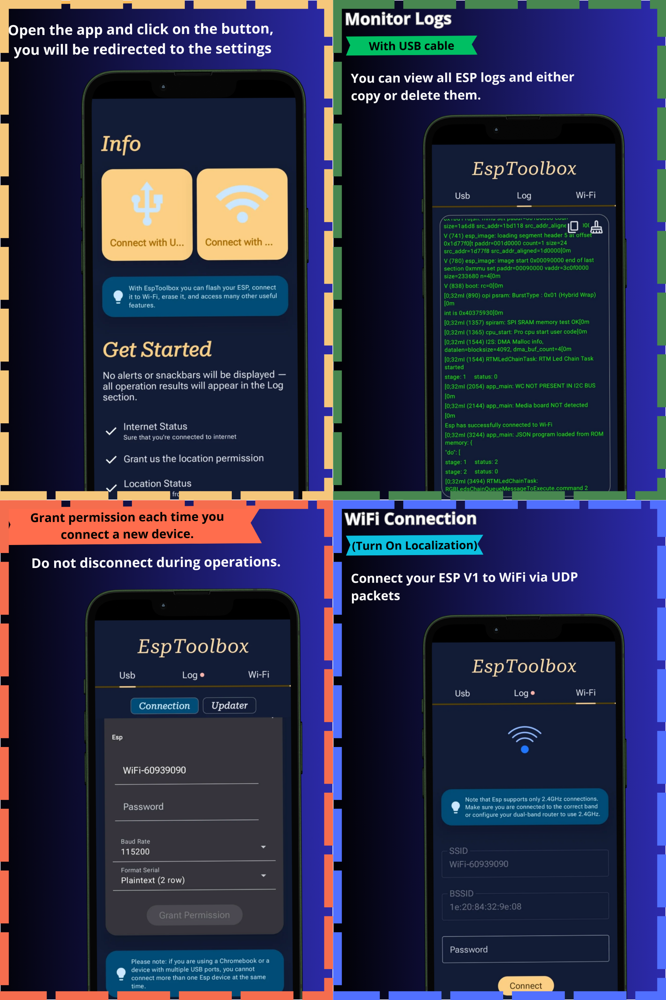

# EspToolbox 🚀

Manage your **ESP32** and **ESP8266** boards directly from your Android smartphone, hassle-free! Everything you need to program, configure, and diagnose your devices, all in one app.

## 🔹 Key Features

* **Easy Wi-Fi** – Configure your board’s network in just a few taps.
* **Erase & Reset** – Wipe the flash memory and start fresh.
* **Firmware Flash** – Upload compatible firmware directly from your phone.
* **Serial & Diagnostics** – Monitor the board, send commands, and read data in real time.

## 💡 Ideal For

Makers, developers, technicians, and IoT enthusiasts who want to work with ESP boards without needing a PC.

## 🔒 Privacy

No data collected: **all operations are performed locally** on your device.

## 🌟 Open Source

EspToolbox is fully open source. Want to contribute? Check out the repository and join the community!

---
