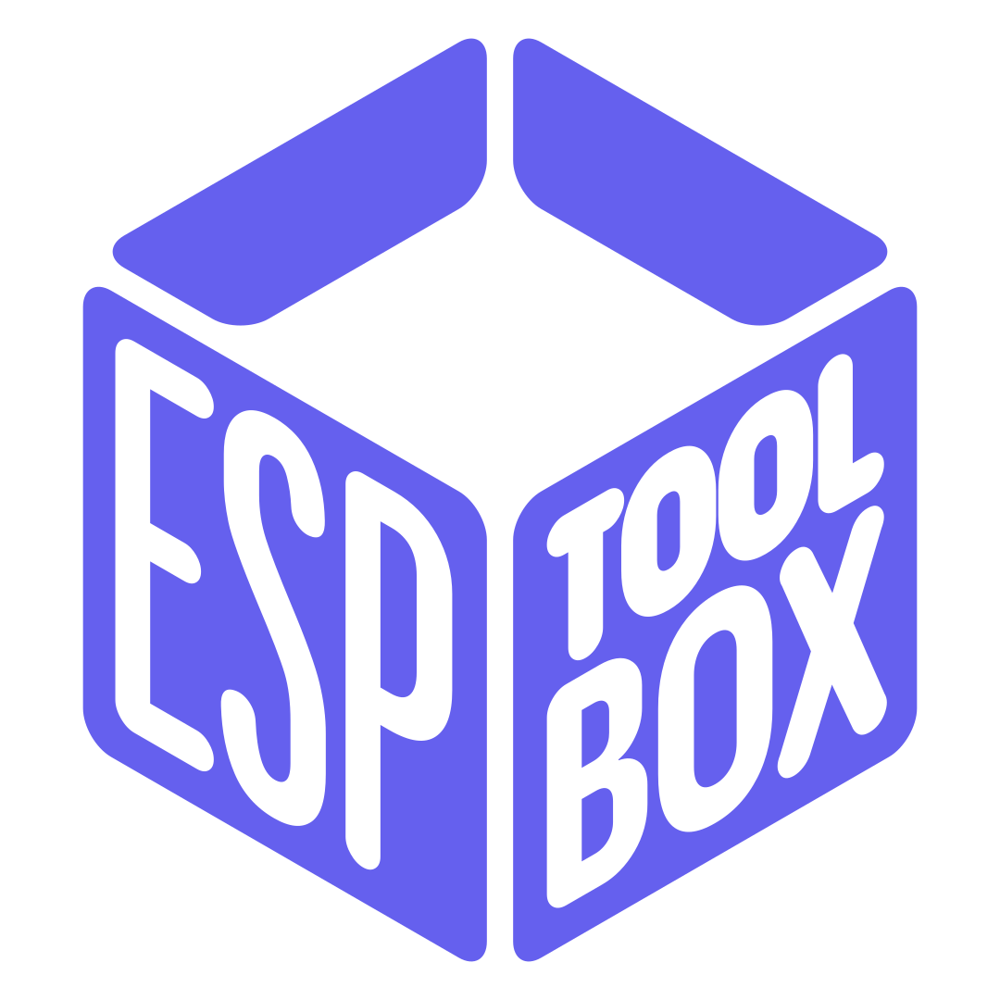

<div align="center">



# EspToolbox

**Flash, provision and monitor ESP32 / ESP8266 boards from an Android phone — no PC, no cables to a desktop, no toolchain.**

[](#requirements)
[-3DDC84?logo=android&logoColor=white)](#requirements)
[](https://kotlinlang.org)
[](https://developer.android.com/compose)
[](LICENSE)
[](#)

</div>

---

EspToolbox talks to Espressif boards directly over the phone's USB-OTG port and over Wi‑Fi. It re-implements the ESP ROM serial loader protocol in Kotlin, so firmware flashing, chip detection and the serial monitor all run **on-device** — nothing is uploaded anywhere, no companion desktop app is required.

The whole device-facing logic lives in a self-contained Gradle module, [`:esp32`](#the-esp32-module), which the UI module consumes but never bypasses.

> [!NOTE]
> Everything runs locally. The app requests no analytics, no accounts and no cloud round-trips. The only network usage is the Wi‑Fi provisioning broadcast, which stays on your LAN.

## Features

| | Feature | Transport | Where it lives |
|---|---|---|---|
| ⚡ | **Firmware flash** — write a `.bin` at an arbitrary offset, with progress reporting | USB serial | `firmware/EspRepo` |
| 🔎 | **Chip detection** — auto-identify the connected SoC via its magic register | USB serial | `firmware/EspRepo` + `params/EspModel` |
| 📶 | **Wi‑Fi provisioning** — push SSID/password with ESP‑Touch (SmartConfig) | UDP broadcast | `wifi/EspTouchRepo` |
| 🔌 | **Serial credentials** — send SSID/password over the wire in 6 selectable formats | USB serial | `usb/UsbRepo` + `params/SerialFormat` |
| 🖥️ | **Live serial monitor** — stream the board's log output in real time | USB serial | `usb/UsbRepo` + `LogRepo` |
| 🔁 | **Reset / boot control** — toggle DTR/RTS to reboot or enter download mode | USB serial | `usb/UsbRepo` |

## Architecture

Two Gradle modules, one clear direction of dependency. The app never links against usb-serial or ESP‑Touch on its own — those are encapsulated (and, where types leak, re-exported) by `:esp32`.


```
├── app/        Jetpack Compose UI, navigation, DI (Koin), ViewModels
└── esp32/      Android library — all board communication (this is the interesting part)
```

---

## The `:esp32` module

A standalone Android **library** (`com.android.library`, no Compose, no UI) that owns every byte exchanged with the board. It targets `minSdk 27`, compiles against JVM 17, and can be reused in any other Android project.

### Dependencies it wraps

| Dependency | Version | Purpose |
|---|---|---|
| [`usb-serial-for-android`](https://github.com/mik3y/usb-serial-for-android) | 3.10.0 | USB CDC/FTDI/CP210x/CH34x serial drivers (exposed via `api`) |
| [`lib-esptouch-android`](https://github.com/EspressifApp/EsptouchForAndroid) | 1.1.1 | Espressif ESP‑Touch / SmartConfig provisioning |
| `physical_oid.aar` | vendored | Physicaloid low-level serial layer used by the ROM loader |
| `kotlinx-coroutines-android` | 1.9.0 | Off-main-thread I/O |

### Flashing firmware without a PC

The hard part of this project is putting `esptool.py` in your pocket. Normally you flash an ESP board from a computer running Espressif's Python tool; here that whole job is done by the phone.

The idea is simple to state: every ESP chip ships with a tiny **boot ROM** that already knows how to talk over the serial line and write to flash. You don't need a computer — you need something that speaks its language. So the module implements that conversation directly in Kotlin:

1. **Wake the chip up.** It repeatedly sends a sync message until the board answers, which also locks onto the right transfer speed.
2. **Ask "who are you?"** The chip exposes an identity value; the module reads it and matches it against a table of known models, so it knows exactly which board is plugged in.
3. **Prepare the flash**, then stream the firmware over in small chunks, each one checksummed so a corrupted block can be caught and re-sent.
4. **Report progress** back to the UI as a percentage while the transfer runs.

It's intentionally lean — no reset dance, no intermediate loader uploaded to RAM first. Just the minimum handshake needed to get bytes onto the chip reliably from a phone.

### Knowing which chip is connected

Espressif sells a whole family — the classic ESP32, the low-power `S` and `C` variants, the newer `H2`. Each one reports a different identity, so before doing anything the module fingerprints the board and refuses to continue if it doesn't recognise it. Supported today:

`ESP8266` · `ESP32` · `ESP32‑S2` · `ESP32‑S3` · `ESP32‑C2` · `ESP32‑C3` · `ESP32‑C6` · `ESP32‑H2`

### Rebooting the board the way the buttons do

On a dev board you hold **BOOT** and tap **RESET** to enter download mode. Those buttons are just wired to two control lines on the USB connection (DTR and RTS). Since the phone drives those same lines, the app can reboot the board or drop it into flashing mode entirely in software — no fingers on tiny buttons required.

### Talking to the running firmware

Once a board is up, the module opens a live serial channel: it streams the board's log output into the app in real time, and can send data the other way. This is also how Wi‑Fi credentials get pushed over the cable — but since every firmware expects them in its own shape, the module offers a handful of ready-made encodings (plain text, JSON, CSV, AT‑style commands, and a couple more) so it can match whatever the board on the other end is listening for.

### Provisioning over the air (no cable at all)

For boards you can't or don't want to plug in, the module wraps Espressif's **ESP‑Touch** (SmartConfig). The trick behind it: the phone encodes the Wi‑Fi password into the *pattern* of network packets it broadcasts, and a listening ESP board — even one not yet on any network — can sniff that pattern out of the air and join. You type the password once on the phone and the board is on your Wi‑Fi seconds later.

---
## License

Released under the [MIT License](LICENSE) © 2025 Daniele.
